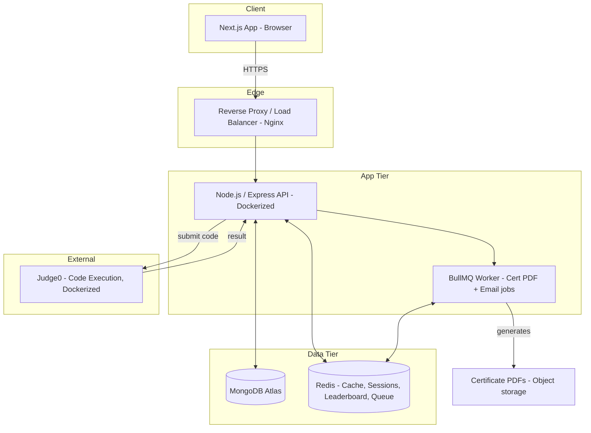

# Beyownd — System Design Document

This is the document you'd walk an interviewer through. It covers Functional & Non-Functional Requirements, High-Level Design, data model, and capacity planning — the exact structure a real engineering team produces before writing code.

---

## 1. Functional Requirements (FR)

| ID | Requirement |
| --- | --- |
| FR1 | Users can sign up, log in, and reset passwords |
| FR2 | Students can browse courses and enroll |
| FR3 | System enforces sequential module unlocking based on completion |
| FR4 | Students can attempt quizzes; system auto-grades and stores results |
| FR5 | System maintains a real-time leaderboard ranked by points |
| FR6 | On course completion, system auto-generates a PDF certificate with a unique verifiable ID |
| FR7 | Anyone can verify a certificate's authenticity via a public URL, no login required |
| FR8 | Admin can view enrollment stats, completion funnels, and manage courses/content |
| FR9 | (Should-have) Students can write and execute code against test cases in-browser |

## 2. Non-Functional Requirements (NFR)

| ID | Requirement | Target |
| --- | --- | --- |
| NFR1 | Concurrency | Support 1,000–2,000 concurrent users at MVP; architecture should not block scaling to 10k later |
| NFR2 | Latency | API p95 response time \< 300ms for read-heavy endpoints (course list, leaderboard) |
| NFR3 | Availability | 99% uptime during launch window (Nov) — no single point of failure on the app tier |
| NFR4 | Leaderboard freshness | Rank updates visible within \~1–2 seconds of a quiz submission |
| NFR5 | Security | Passwords hashed (bcrypt/argon2), JWT with short expiry + refresh tokens, rate-limited auth endpoints |
| NFR6 | Data integrity | Certificate records immutable once issued (no silent edits) |
| NFR7 | Portability | Fully containerized (Docker) — must run identically in dev and prod |
| NFR8 | Observability | Basic structured logging + health-check endpoints for every service |

---

## 3. High-Level Architecture

**Why this shape:**

- **Nginx in front** — even at MVP scale, a reverse proxy gives you SSL termination, basic rate limiting, and room to add a second API instance later without touching app code.
- **Stateless API tier** — no session state lives in the Node process itself; everything shared (sessions, leaderboard, job queue) lives in Redis. This means you can run 2-3 API containers behind the load balancer with zero code changes if you need to scale horizontally.
- **BullMQ worker separated from the API** — certificate PDF generation and emails are slow, blocking operations. They run in a separate worker process pulling from a Redis-backed queue, so a burst of course completions never slows down someone browsing the leaderboard.
- **Judge0 isolated** — code execution is inherently risky (arbitrary code execution) and resource-heavy. Running it as its own Dockerized service keeps a runaway submission from taking down your main API.

## 4. Redis Usage Breakdown (be specific — this is a common interview follow-up)

- **Leaderboard:** `ZADD leaderboard <score> <userId>` — sorted set, O(log N) inserts, `ZREVRANGE` for top-N reads
- **Session/JWT blacklist:** short-lived keys for logout/revocation
- **Caching:** course catalog, syllabus structure (rarely changes, read constantly — cache with a TTL + invalidate on admin edit)
- **Job queue:** BullMQ uses Redis under the hood for the certificate/email worker
- **Rate limiting:** sliding window counters on auth endpoints

## 5. Data Model (MongoDB — high level collections)

- `users` — profile, role, auth data
- `courses` → `modules` → `lessons` (embedded or referenced depending on read pattern — lessons referenced since they're large content blobs)
- `enrollments` — links user ↔ course, tracks per-module completion status
- `submissions` — quiz/code attempts, graded result, points awarded
- `certificates` — immutable record: certId (UUID), userId, courseId, issueDate, verificationHash
- `leaderboard` — primarily lives in Redis for speed; periodically synced/snapshotted to Mongo for durability/history

## 6. Capacity Estimation (back-of-envelope, the way a real design review does it)

- Target: 2,000 concurrent users at peak (launch week)
- Assume each active user triggers \~1 request every 5 seconds while active (browsing/quiz-taking) → \~400 req/sec peak
- A single Node.js API instance can typically handle several hundred to \~1000 lightweight req/sec depending on payload — **1-2 API container instances behind Nginx comfortably covers this**, with Redis absorbing the read-heavy leaderboard/catalog traffic so Mongo isn't hit on every request
- This is why the "stateless API + Redis cache" design matters: it's what lets you go from 1 to 3 containers later by changing a docker-compose replica count, not by re-architecting

## 7. Deployment Strategy (MVP)

- `docker-compose.yml` defining: `api`, `worker`, `nginx`, `judge0`, with `mongo` (Atlas, so external) and `redis` (can be self-hosted container or managed — self-hosted is fine at this scale)
- Single VPS or small cloud instance is enough for 1-2k concurrent at MVP — don't reach for Kubernetes yet, that's premature complexity for this stage
- CI: on push to main → run tests → build Docker images → deploy (even a simple GitHub Actions pipeline counts as "production-grade" here — it's the discipline that matters, not the tool's fanciness)

---

**Next step:** once you've read all three docs, we lock the final schema field-by-field and the API route list, then start scaffolding the repo.
